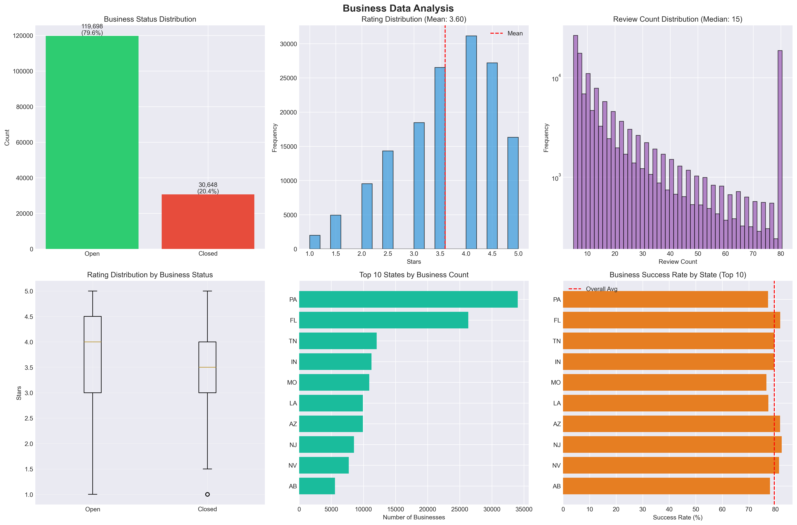
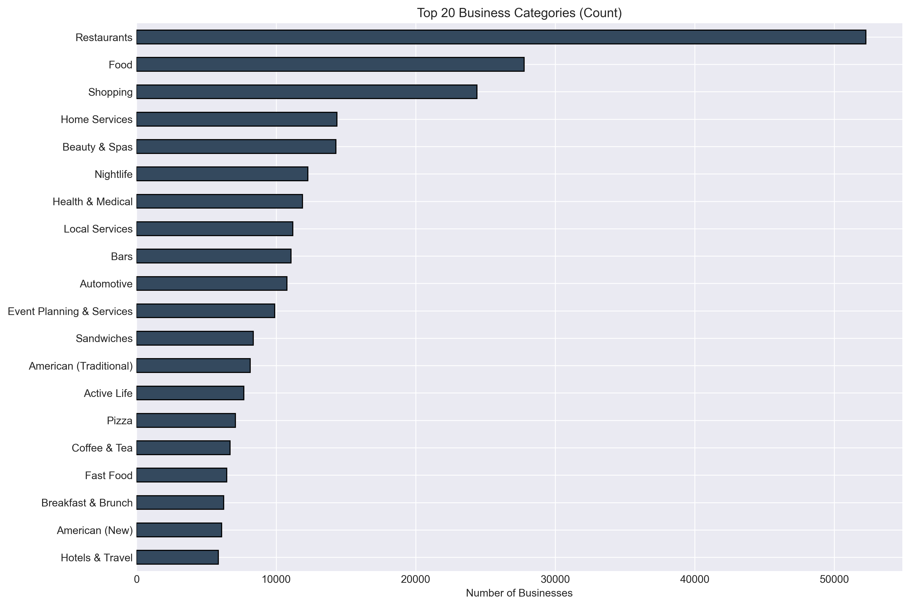
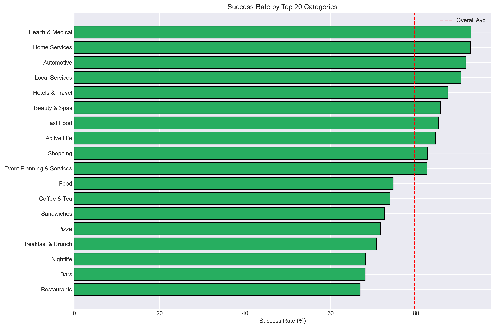
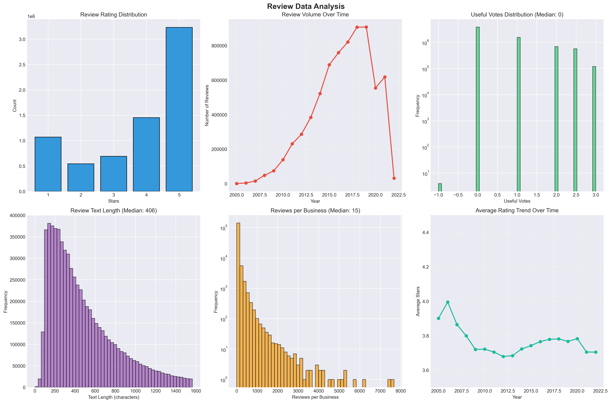
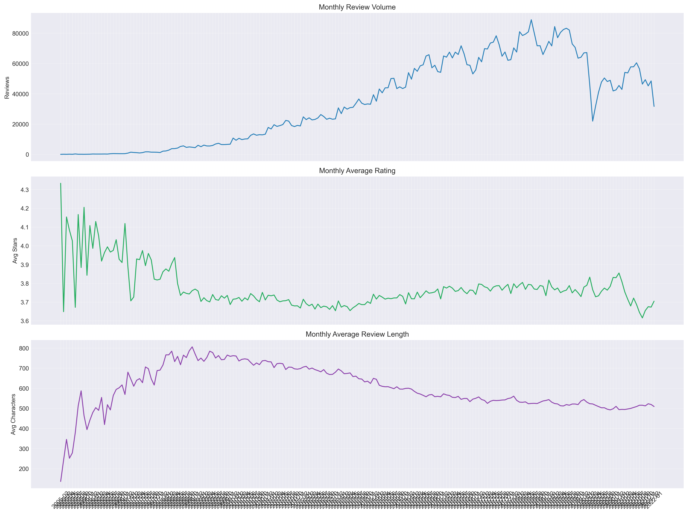
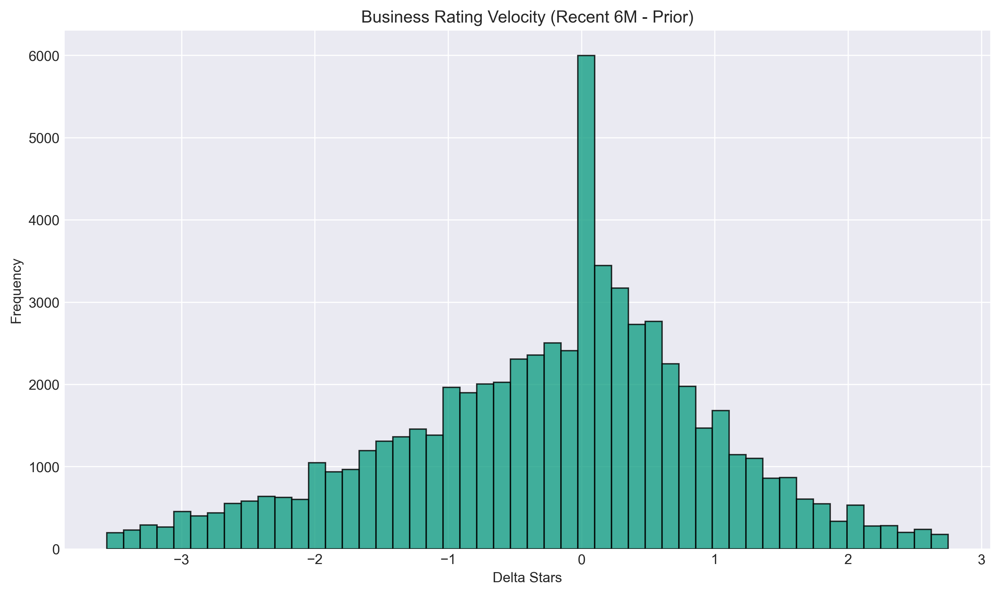
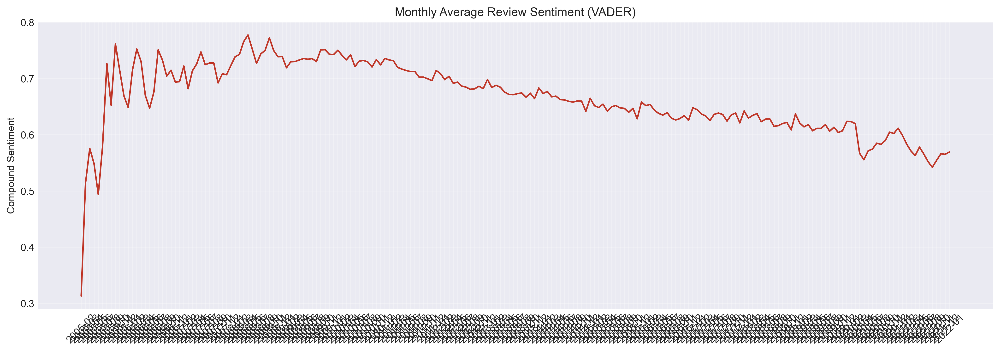
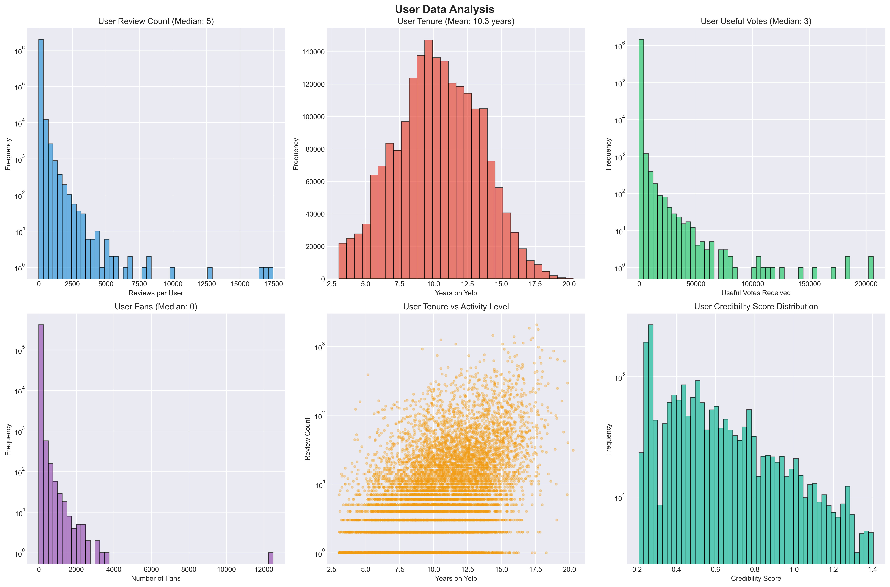
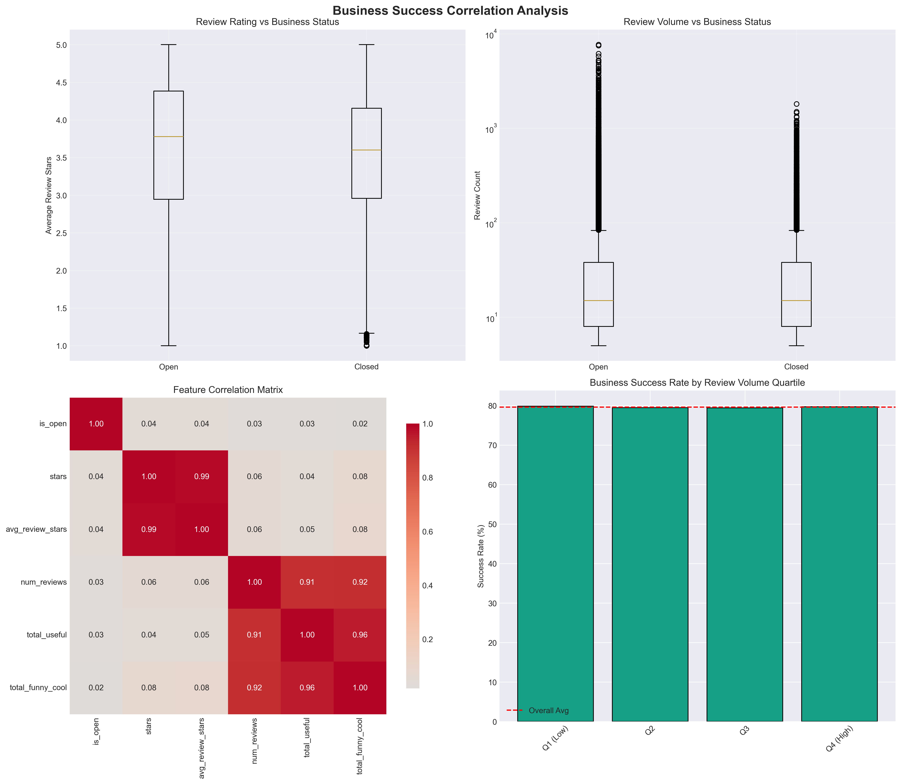

# CS 412 Research Project - EDA Report

Generated: 2025-10-29 23:42:45

## Overview
This report summarizes data cleaning results and exploratory analysis for the Yelp-based business success prediction project. It includes dataset summaries and commentary for each visualization.

Note: EDA visualizations use the full reviews/users datasets.

## 1. Business Data Summary
Total businesses: 150,346
Open businesses: 119,698 (79.62%)
Closed businesses: 30,648 (20.38%)
Average rating: 3.60
Unique states: 27
Unique cities: 1416

### Figure: Business Analysis

### Figures: Top Categories

- Ratings skew modestly positive; median review counts are low with a long tail.
- Success rate (open) aligns with expectations (~80%), confirming class imbalance.
- Success varies across states; location features may add signal.

## 2. Review Data Summary
Total reviews: 6,990,280
Unique businesses reviewed: 150,346
Average review rating: 3.75
Date range: 2005-02-16 03:23:22 to 2022-01-19 19:48:45

### Figure: Review Analysis

### Figures: Temporal & Text Trends

- Reviews trend upward over years; ratings average ~3.8–4.0.
- Useful votes and text lengths are heavy-tailed; consider robust aggregations.
- Temporal features like rating velocity and review frequency are promising.

## 3. User Data Summary
Total users: 1,987,897
Average reviews per user: 23.39
Average user tenure: 10.32 years
Average useful votes per user: 42.30

### Figure: User Analysis

- User activity and engagement are highly skewed; small power-user group dominates.
- Tenure distribution supports credibility weighting; combine with useful votes.

## 4. Correlation & Key Insights for Modeling
### Figure: Correlation Analysis

✓ Class Imbalance: ~80% open, ~20% closed - Need stratified sampling/SMOTE
✓ Text Data: Reviews contain rich text - Sentiment analysis needed
✓ Temporal Patterns: Reviews span multiple years - Temporal features important
✓ User Weighting: High variance in user credibility - User weighting critical
✓ Geographic Variation: Success rates vary by state/city - Location features needed
