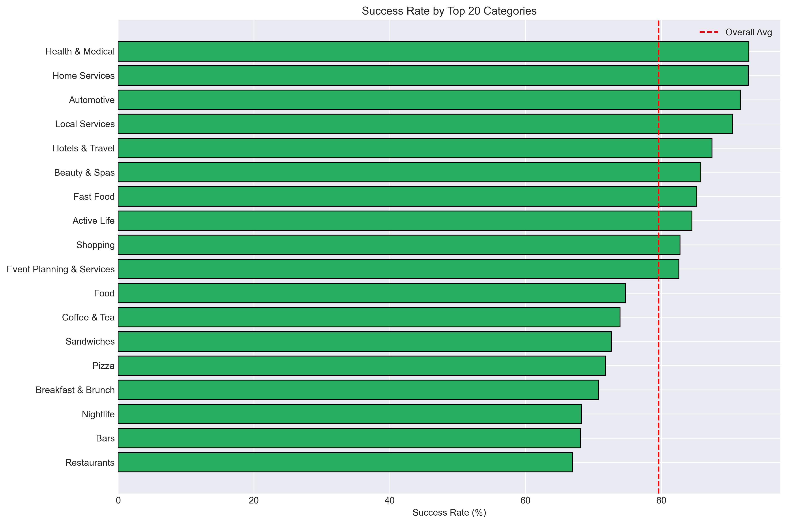
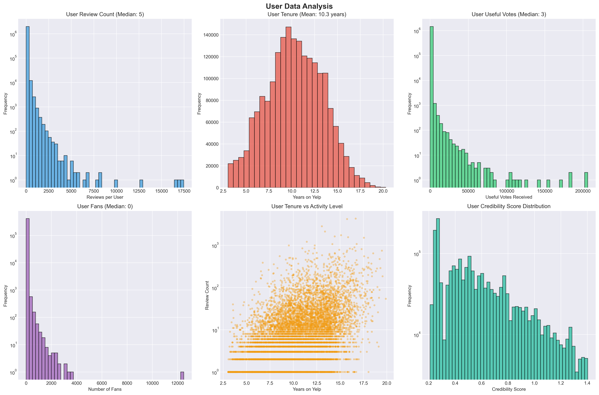

# CS 412 Research Project - EDA Report

Generated: 2025-12-01 08:49:10

## Overview
This report summarizes data cleaning results and exploratory analysis for the Yelp-based business success prediction project. It includes dataset summaries and commentary for each visualization.

Note: EDA visualizations use the full reviews/users datasets.

## 1. Business Data Summary
Total businesses: 140,858
Open businesses: 111,297 (79.01%)
Closed businesses: 29,561 (20.99%)
Average rating: 3.50
Unique states: 26
Unique cities: 1363

### Figure: Business Analysis

### Figures: Top Categories

- Ratings skew modestly positive; median review counts are low with a long tail.
- Success rate (open) aligns with expectations (~80%), confirming class imbalance.
- Success varies across states; location features may add signal.

## 2. Review Data Summary
Total reviews: 1,372,781
Unique businesses reviewed: 30,068
Average review rating: 3.77
Date range: 2005-03-01 17:47:15 to 2022-01-19 19:47:59

### Figure: Review Analysis

### Figures: Temporal & Text Trends

- Reviews trend upward over years; ratings average ~3.8–4.0.
- Useful votes and text lengths are heavy-tailed; consider robust aggregations.
- Temporal features like rating velocity and review frequency are promising.

## 3. User Data Summary
Total users: 1,987,897
Average reviews per user: 23.39
Average user tenure: 10.32 years
Average useful votes per user: 42.30

### Figure: User Analysis

- User activity and engagement are highly skewed; small power-user group dominates.
- Tenure distribution supports credibility weighting; combine with useful votes.

## 4. Correlation & Key Insights for Modeling
### Figure: Correlation Analysis

[OK] Class Imbalance: ~80% open, ~20% closed - Need stratified sampling/SMOTE
[OK] Text Data: Reviews contain rich text - Sentiment analysis needed
[OK] Temporal Patterns: Reviews span multiple years - Temporal features important
[OK] User Weighting: High variance in user credibility - User weighting critical
[OK] Geographic Variation: Success rates vary by state/city - Location features needed
