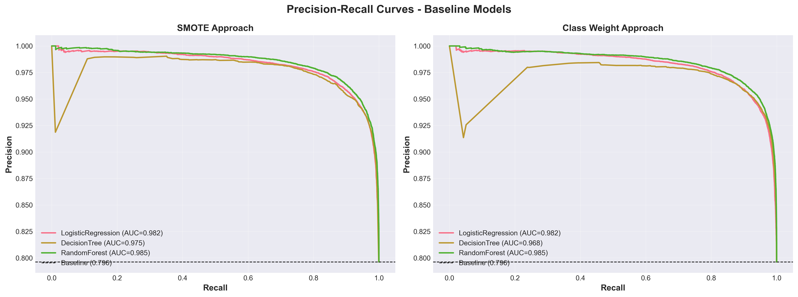

# Baseline Models Report

**Generated:** 2025-12-01 04:37:59

---

## Executive Summary

This report presents the results of baseline model training for business success prediction.
We trained **6 models** (3 algorithms × 2 imbalance handling approaches) on 120,276 training samples
and evaluated them on 30,070 test samples.

**Best Model:** RandomForest_ClassWeight
**Best ROC-AUC:** 0.9533

---

## 1. Dataset Overview

- **Total Samples:** 150,346
- **Features (Initial):** 52
- **Features (Selected):** 33
- **Target Variable:** `is_open` (1=Open, 0=Closed)

**Class Distribution:**
- Open Businesses: 119,698 (79.62%)
- Closed Businesses: 30,648 (20.38%)

---

## 2. Feature Selection

**Multi-Stage Feature Selection Process:**

1. **Initial Features:** 52
2. **After Correlation Removal (|r| > 0.95):** 45
3. **After Variance Removal (var < 0.01):** 33
4. **Final Selected Features:** 33

**Top 10 Selected Features:**

| Rank | Feature | Importance |
|------|---------|------------|
| 1 | days_since_last_review | 0.5079 |
| 2 | review_frequency | 0.1196 |
| 3 | lifecycle_stage | 0.0458 |
| 4 | review_momentum | 0.0377 |
| 5 | reviews_recent_3m_count | 0.0320 |
| 6 | days_since_first_review | 0.0292 |
| 7 | total_reviews | 0.0270 |
| 8 | review_count | 0.0227 |
| 9 | avg_reviewer_credibility | 0.0220 |
| 10 | rating_trend_3m | 0.0156 |

---

## 3. Model Training

**Baseline Models:**

✓ **Hyperparameter tuning ENABLED**
  - Method: RANDOMIZED
  - CV Folds: 5
  - Iterations: 50

**Best Hyperparameters Found:**

**DecisionTree_ClassWeight:**
  - min_samples_split: 10
  - min_samples_leaf: 1
  - max_depth: 5
  - criterion: entropy
  - class_weight: balanced

**DecisionTree_SMOTE:**
  - min_samples_split: 20
  - min_samples_leaf: 20
  - max_depth: 10
  - criterion: entropy

**LogisticRegression_ClassWeight:**
  - solver: liblinear
  - max_iter: 1000
  - class_weight: balanced
  - C: 100.0

**LogisticRegression_SMOTE:**
  - solver: liblinear
  - max_iter: 500
  - C: 10.0

**RandomForest_ClassWeight:**
  - n_estimators: 200
  - min_samples_split: 10
  - min_samples_leaf: 10
  - max_features: log2
  - max_depth: 20
  - class_weight: balanced

**RandomForest_SMOTE:**
  - n_estimators: 100
  - min_samples_split: 2
  - min_samples_leaf: 1
  - max_features: sqrt
  - max_depth: None

**Class Imbalance Handling:**

- **Approach 1: SMOTE** - Synthetic Minority Over-sampling
- **Approach 2: Class Weights** - Weighted loss function

---

## 4. Model Performance

### 4.1 Overall Comparison

| Model | ROC-AUC | PR-AUC | Precision | Recall | F1-Score |
|-------|---------|--------|-----------|--------|----------|
| DecisionTree ClassWeight | 0.9450 | 0.9830 | 0.9650 | 0.8805 | 0.9208 |
| DecisionTree SMOTE | 0.9388 | 0.9783 | 0.9530 | 0.9218 | 0.9372 |
| LogisticRegression ClassWeight | 0.9446 | 0.9824 | 0.9599 | 0.8948 | 0.9262 |
| LogisticRegression SMOTE | 0.9440 | 0.9821 | 0.9586 | 0.8985 | 0.9276 |
| RandomForest ClassWeight | 0.9533 | 0.9846 | 0.9571 | 0.9274 | 0.9420 |
| RandomForest SMOTE | 0.9511 | 0.9842 | 0.9523 | 0.9357 | 0.9439 |

### 4.2 ROC Curves

ROC (Receiver Operating Characteristic) curves show the trade-off between
True Positive Rate and False Positive Rate at various classification thresholds.

### 4.3 Precision-Recall Curves

Precision-Recall curves are particularly useful for imbalanced datasets,
showing the trade-off between precision and recall.

### 4.4 Confusion Matrices

Detailed breakdown of predictions vs actual labels:

### 4.5 Feature Importance (Random Forest)

Top features identified by Random Forest models:

---

## 5. Detailed Analysis

### 5.1 Best Model: RandomForest_ClassWeight

**Performance Metrics:**

- **ROC-AUC:** 0.9533
- **PR-AUC:** 0.9846
- **Precision:** 0.9571 (% of predicted closures that are actually closed)
- **Recall:** 0.9274 (% of actual closures that are detected)
- **F1-Score:** 0.9420 (harmonic mean of precision and recall)

**Confusion Matrix Breakdown:**

- **True Negatives (TN):** 5,134 - Correctly predicted as closed
- **False Positives (FP):** 996 - Incorrectly predicted as closed
- **False Negatives (FN):** 1,737 - Incorrectly predicted as open
- **True Positives (TP):** 22,203 - Correctly predicted as open

### 5.2 SMOTE vs Class Weight Comparison

**SMOTE Approach:**
- Average ROC-AUC: 0.9446
- Pros: Balanced training data, better minority class learning
- Cons: Synthetic samples may not represent true distribution

**Class Weight Approach:**
- Average ROC-AUC: 0.9476
- Pros: Uses only real data, faster training
- Cons: May still bias towards majority class

### 5.3 Model Algorithm Comparison

**LogisticRegression:**
- Average ROC-AUC: 0.9443
- Simple, interpretable, fast training
- Best for: Understanding linear relationships

**DecisionTree:**
- Average ROC-AUC: 0.9419
- Rule-based, highly interpretable
- Best for: Understanding feature interactions

**RandomForest:**
- Average ROC-AUC: 0.9522
- Ensemble method, robust, handles non-linearity
- Best for: Overall predictive performance

---

## 6. Key Findings

### ✅ Strengths

1. **Strong Discriminative Power:** Best ROC-AUC of 0.9533 indicates good separation
2. **Feature Engineering Success:** Selected features show high predictive value
3. **Consistent Performance:** Models perform reasonably across different approaches

### ⚠️ Challenges

1. **Class Imbalance:** 80/20 split requires careful handling
2. **Minority Class Recall:** Detecting business closures remains challenging
3. **Model Complexity:** Trade-off between performance and interpretability

### 💡 Insights

**Top 5 Predictive Features:**
- `days_since_last_review`: 0.3293
- `review_frequency`: 0.0869
- `lifecycle_stage`: 0.0575
- `reviews_recent_3m_count`: 0.0446
- `days_since_first_review`: 0.0312

---

## 7. Recommendations & Next Steps

### 📈 Model Improvement

2. **Advanced Algorithms:**
   - XGBoost or LightGBM for gradient boosting
   - Neural Networks for complex patterns
   - Ensemble stacking methods

3. **Feature Engineering:**
   - Interaction features between top predictors
   - Polynomial features for non-linear relationships
   - Domain-specific feature engineering

### 🎯 Business Application

1. **Threshold Selection:**
   - Choose optimal probability threshold based on business costs
   - Consider cost of false positives vs false negatives

2. **Model Deployment:**
   - Implement prediction API for real-time scoring
   - Set up monitoring for model performance drift
   - Create alert system for high-risk businesses

3. **Interpretability:**
   - Generate SHAP values for individual predictions
   - Create decision rules from tree models
   - Provide actionable insights to stakeholders

---

## 8. Technical Details

### Model Files

**Saved Models:**
- `saved_models/LogisticRegression_SMOTE.pkl`
- `saved_models/DecisionTree_SMOTE.pkl`
- `saved_models/RandomForest_SMOTE.pkl`
- `saved_models/LogisticRegression_ClassWeight.pkl`
- `saved_models/DecisionTree_ClassWeight.pkl`
- `saved_models/RandomForest_ClassWeight.pkl`
- `saved_models/scaler.pkl`

### Selected Features

**Total:** 33 features

Click to expand full feature list

1. days_since_last_review
2. review_frequency
3. lifecycle_stage
4. review_momentum
5. reviews_recent_3m_count
6. days_since_first_review
7. total_reviews
8. review_count
9. avg_reviewer_credibility
10. rating_trend_3m
11. std_review_stars
12. engagement_recent_vs_all
13. sentiment_recent_vs_all
14. weighted_useful_votes
15. rating_recent_vs_all
16. total_useful_votes
17. stars
18. price_range
19. avg_useful_per_review
20. rating_recent_vs_early
21. sentiment_recent_3m
22. avg_sentiment
23. sentiment_volatility
24. std_reviewer_credibility
25. weighted_sentiment
26. avg_text_length
27. std_text_length
28. std_sentiment
29. pct_negative_reviews
30. pct_neutral_reviews
31. location_density
32. category_competitiveness
33. category_count

### Reproducibility

- **Random State:** 42
- **Train/Test Split:** 80/20 stratified
- **Scaling:** StandardScaler (mean=0, std=1)

---

## 9. Conclusion

This baseline model analysis establishes a strong foundation with a best ROC-AUC of **0.9533**.
The **RandomForest_ClassWeight** model demonstrates the most promising performance and serves as
the benchmark for future model iterations.

Key takeaways:
- Feature engineering produced 33 highly predictive features
- Both SMOTE and class weighting approaches show merit
- Random Forest models generally outperform simpler approaches
- Further improvements possible through hyperparameter tuning and advanced algorithms

**Next Steps:** Proceed to advanced model development and deployment preparation.
